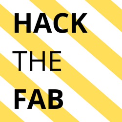

## Thema 

#### Welche Rolle spielt Cyber-Sicherheit in der vernetzten Fabrik?

> Industry 4.0 signifies a seismic shift in the way the modern factories and industrial systems operate. They consist of **large-scale integration across an entire ecosystem** where data inside and outside the organization converges to create new products, predict market demands and reinvent the value chain. In Industry 4.0, we see the **convergence of information technology (IT) and operational technology (OT)** at scale.

[[Forbes](https://www.forbes.com/sites/forbestechcouncil/2020/10/20/lack-of-cybersecurity-consideration-could-upend-industry-40/?sh=da7d04e56ab0)]

Mit dem Zusammenwachsen (engl. convergence) von IT und OT und der Vernetzung kompletter Fabriken müssen sich Maschinenbauer dem Thema Security stellen.

OT- und Product-Security von Maschinen wird dabei ein grundlegender Erfolgsfaktor für die erfolgreiche digitale Transformation sein. 

OT "funktioniert" in vielen Bereichen anders als IT:

 * Echtzeitanwendungen, die Ressourcenintensiv sind

 * möglichst wenige Einflüsse auf die Produktion

 * Software- und Betriebssystemupdates sind oft mit Schwierigkeiten verbunden

 * und viele mehr

Genau deshalb braucht es kreative und praktikable Lösungen.

An unserem Hackahon wollen wir in Teams die Herausforderung Cyber-Security verstehen und Lösungen entwickeln.

### Challenge 1

tbd

### Challenge 2

tbd

## Sponsored by

Wichtige Daten:

 * [Anmeldung]() bis zum 15. Juni

 * Hackathon - 20. Juli
  
    * Hackathon **Kick-off** - 9 Uhr

    * Hackathon **Pitch** - 16 Uhr

    * **Beer & Burger** - 17:30 Uhr

### Euer Mehrwert

* Arbeitet gemeinsamen an Lösungen

* Lernt neue Skills

* Lernt Ideen zu pitchen

* Netzwerkt mit Firmen und gleichgesinnten

* "Kack the Fab" Shirt

### Teilnahme

Auch wenn es bei Hackathons darum geht, Probleme mit Technologie zu lösen, sind an den erfolgreichsten Projekten immer Personen mit unterschiedlichen Begabungen und Jobs beteiligt.

Um den perfekten Mix zu erreichen sollte euer Team eine Mischung aus folgenden Personen haben:

1. **Coder**: Techniker, Entwickler, Ingenieure die Kenntnisse in vielen verschiedenen technischen Bereichen mitbringen

2. **Innovator**: Projektowner, Projektmanager die Ideen überprüfen und die Herausforderung formulieren

## Bewertungskriterien

### Ergebnis [60%]

### Kreativität [20%]

 * Der Ansatz **unterscheidet** sich deutlich von anderen Einreichungen

 * Das Team beweist **Kreativität** bei der Lösung des Problems

 * **Einsatz von geeigneter Software** zur Unterstützung der Problemlösung

### Präsentation [20%]

 * Titel, Überschriften, Beschriftungen: Angemessene Größe, Position, Rechtschreibung und Inhalt

 * Teamarbeit bei der Umsetzung

 * Struktur und Verständlichkeit
    