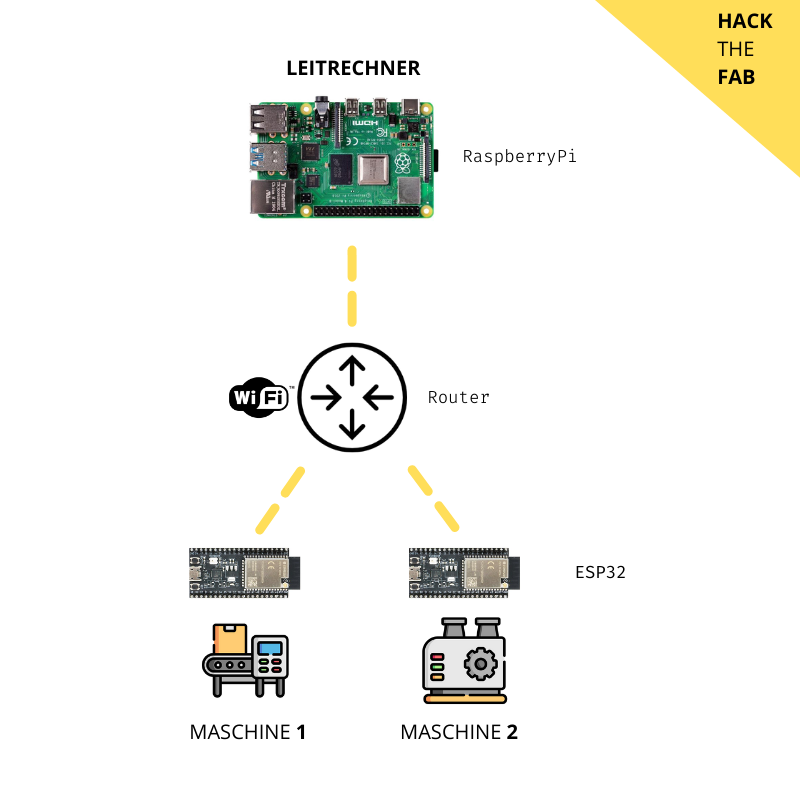
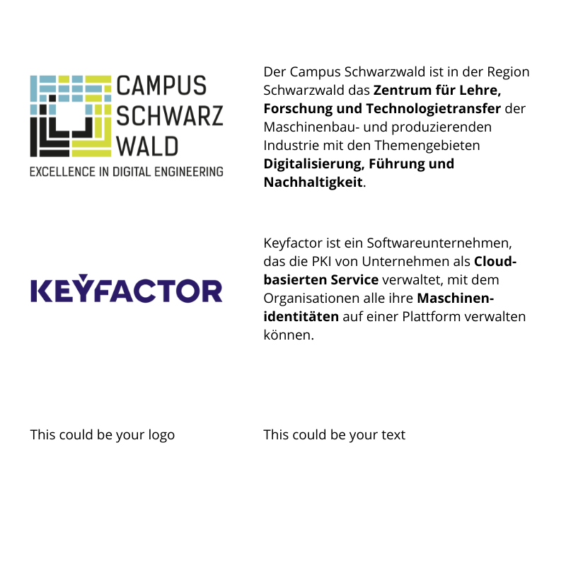

#### Welche Rolle spielt Cyber-Sicherheit in der vernetzten Fabrik?

> Industry 4.0 signifies a seismic shift in the way the modern factories and industrial systems operate. They consist of **large-scale integration across an entire ecosystem** where data inside and outside the organization converges to create new products, predict market demands and reinvent the value chain. In Industry 4.0, we see the **convergence of information technology (IT) and operational technology (OT)** at scale.

[[Forbes](https://www.forbes.com/sites/forbestechcouncil/2020/10/20/lack-of-cybersecurity-consideration-could-upend-industry-40/?sh=da7d04e56ab0)]

Mit dem Zusammenwachsen (engl. convergence) von IT und OT und der Vernetzung kompletter Fabriken müssen sich Maschinenbauer dem Thema Security stellen.

OT- und Product-Security von Maschinen wird dabei ein grundlegender Erfolgsfaktor für die erfolgreiche digitale Transformation sein. 

OT "funktioniert" in vielen Bereichen anders als IT:

 * Echtzeitanwendungen, die Ressourcenintensiv sind

 * möglichst wenige Einflüsse auf die Produktion

 * Software- und Betriebssystemupdates sind oft mit Schwierigkeiten verbunden

 * und viele mehr

Genau deshalb braucht es kreative und praktikable Lösungen.

An unserem Hackahon wollen wir in Teams die Herausforderung Cyber-Security verstehen und Lösungen entwickeln.

Die **MICRO FAB** ist eine kleine Fabrik, an der wir OT-Security am Hackathon sehen und verstehen.

Die Fabrik besteht aus **drei Maschinen** die durch ESP32 Mikrocontroller simuliert werden, sowie einem **Leitrechner**, der (Raspberry Pi) der die Daten die auf den Maschinen generiert werden, aggregiert.

Alle Komponenten sind über einen WLAN Router vernetzt. 

IT-Welt: Netzwerksicherheit / Embedded Security
OT-Welt: OT-Security / Product Security / Embedded Cyber Security

Ideen:

+ Warum ist Sicherheit in der vernetzten Produktion wichtig?
    + Was gilt es zu schützen?
    + 
    
+ Warum können viele Lösungen aus dem IT-Umfeld nicht übernommen werden?
    + IT-Welt: CIA-Triad (Confidentiality, Integrity, Availability)
    + OT-Welt: SRP-Triad (Safety, Reliability, Productivity)
    
+ Um welche Elemente können wir die **MICRO FAB** erweitern um die Cyber-Sicherheit zu erhöhen?
    + Sicherheitstrategie (kurz-, mittel-, langfristig und im Krisenfall) 
    + Mögliche Maßnahmen:
        + Absicherung der Netze
        + Absicherung von Diensten und Protokollen
        + Härtung der Systeme
        + Patchmanagement
        + Authentisierung
        + Schutz vor Schadprogrammen
        + Datensicherung
        + Mobile Datenträger
    

In der **MICRO FAB** gibt es eine Amgreifer der versucht Daten aus unserer Fabrik zu stehlen.

Ziel der **CODER CHALLENGE** ist es den unverschlüsselten Verkehr abzusichern und eine Autorisiweung aller Komponenten in der Fabrik zu ermöglichen.

### Details

+ Die von den Maschinen (Client) generierten Daten werden über **MQTT oder OPC UA** an den Leitrechner (Server) gesendet.

   + Die Daten werden anschließnd in einer MySQL Datenbank gespeichert
   
   + Im Leitstand wird ein Dashboard gehostet (Flask) das die gespeicherten Daten visualisiert
   
+ Die **Kommunikation ist aktuell unverschlüsselt** und es gibt keine sichere Authentisierung

+ OPC UA und MQTT bieten verschiedene Mechanismen für eine sichere Authentisierung und Verschlüsselung. Weitere Details zu OPC UA und MQTT findet ihr [hier](protocols.md)

+ Welche Mechanismen ihr testet und implementiert ist **euch überlassen**. 

 * [Anmeldung]() bis zum 15. Juni

 * Hackathon - 20. Juli
  
    * Hackathon **Kick-off** - 9 Uhr

    * Hackathon **Pitch** - 16 Uhr

    * **Beer & Burger** - 17:30 Uhr
    

   

**Campus Schwarzwald** 
(Centrum für Digitalisierung, Führung und Nachhaltigkeit Schwarzwald gGmbH) 
Herzog-Eberhard-Straße 56 
72250 Freudenstadt 

### Euer Mehrwert 👍

* Arbeitet gemeinsamen an Lösungen

* Lernt neue Skills

* Lernt Ideen zu pitchen

* Netzwerkt mit Firmen und gleichgesinnten

* "Hack the Fab" Shirt

Auch wenn es bei Hackathons darum geht, Probleme mit Technologie zu lösen, sind an den erfolgreichsten Projekten immer Personen mit unterschiedlichen Begabungen und Jobs beteiligt.

Um den perfekten Mix zu erreichen sollte euer Team eine Mischung aus folgenden Personen haben:

1. Techniker, Entwickler, Ingenieure die Kenntnisse in vielen verschiedenen technischen Bereichen mitbringen

2. Projektowner, Projektmanager die Ideen überprüfen und die Herausforderung formulieren

**Die Teilnahme am Hackathon ist kostenlos**

Die Teams sollten sich bemühen, innerhalb der vorgegebenen Zeit eine möglichst vollständige und schlanke Version ihres Projekts zu erstellen. Ihre Leistung wird nach den folgenden Hauptkriterien beurteilt:

 + Technische Schwierigkeit

 + Kreativität und Originalität

 + Nützlichkeit und Geschäftspotenzial

 + Qualität der Präsentation

_____________

    