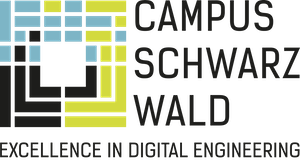

## Thema 🎯

#### Welche Rolle spielt Cyber-Sicherheit in der vernetzten Fabrik?

> Industry 4.0 signifies a seismic shift in the way the modern factories and industrial systems operate. They consist of **large-scale integration across an entire ecosystem** where data inside and outside the organization converges to create new products, predict market demands and reinvent the value chain. In Industry 4.0, we see the **convergence of information technology (IT) and operational technology (OT)** at scale.

[[Forbes](https://www.forbes.com/sites/forbestechcouncil/2020/10/20/lack-of-cybersecurity-consideration-could-upend-industry-40/?sh=da7d04e56ab0)]

Mit dem Zusammenwachsen (engl. convergence) von IT und OT und der Vernetzung kompletter Fabriken müssen sich Maschinenbauer dem Thema Security stellen.

OT- und Product-Security von Maschinen wird dabei ein grundlegender Erfolgsfaktor für die erfolgreiche digitale Transformation sein. 

OT "funktioniert" in vielen Bereichen anders als IT:

 * Echtzeitanwendungen, die Ressourcenintensiv sind

 * möglichst wenige Einflüsse auf die Produktion

 * Software- und Betriebssystemupdates sind oft mit Schwierigkeiten verbunden

 * und viele mehr

Genau deshalb braucht es kreative und praktikable Lösungen.

An unserem Hackahon wollen wir in Teams die Herausforderung Cyber-Security verstehen und Lösungen entwickeln.

### Challenge 1

tbd

### Challenge 2

tbd

## Sponsored by 🚀

## Wichtige Daten 🗓

 * [Anmeldung]() bis zum 15. Juni

 * Hackathon - 20. Juli
  
    * Hackathon **Kick-off** - 9 Uhr

    * Hackathon **Pitch** - 16 Uhr

    * **Beer & Burger** - 17:30 Uhr
   
### Location 🏫

**Campus Schwarzwald** 
(Centrum für Digitalisierung, Führung und Nachhaltigkeit Schwarzwald gGmbH) 
Herzog-Eberhard-Straße 56 
72250 Freudenstadt 

### Euer Mehrwert 👍

* Arbeitet gemeinsamen an Lösungen

* Lernt neue Skills

* Lernt Ideen zu pitchen

* Netzwerkt mit Firmen und gleichgesinnten

* "Hack the Fab" Shirt

### Teilnahme 🙋‍♂️🙋‍♀️

Auch wenn es bei Hackathons darum geht, Probleme mit Technologie zu lösen, sind an den erfolgreichsten Projekten immer Personen mit unterschiedlichen Begabungen und Jobs beteiligt.

Um den perfekten Mix zu erreichen sollte euer Team eine Mischung aus folgenden Personen haben:

1. **Coder**: Techniker, Entwickler, Ingenieure die Kenntnisse in vielen verschiedenen technischen Bereichen mitbringen

2. **Innovator**: Projektowner, Projektmanager die Ideen überprüfen und die Herausforderung formulieren

## Bewertungskriterien 🏆

Die Teams sollten sich bemühen, innerhalb der vorgegebenen Zeit eine möglichst vollständige und schlanke Version ihres Projekts zu erstellen. Ihre Leistung wird nach den folgenden Hauptkriterien beurteilt:

 + Technische Schwierigkeit

 + Kreativität und Originalität

 + Nützlichkeit und Geschäftspotenzial

 + Qualität der Präsentation

_____________

🎉 🎊 😃 Happy Contributing 😃 🎊 🎉
    