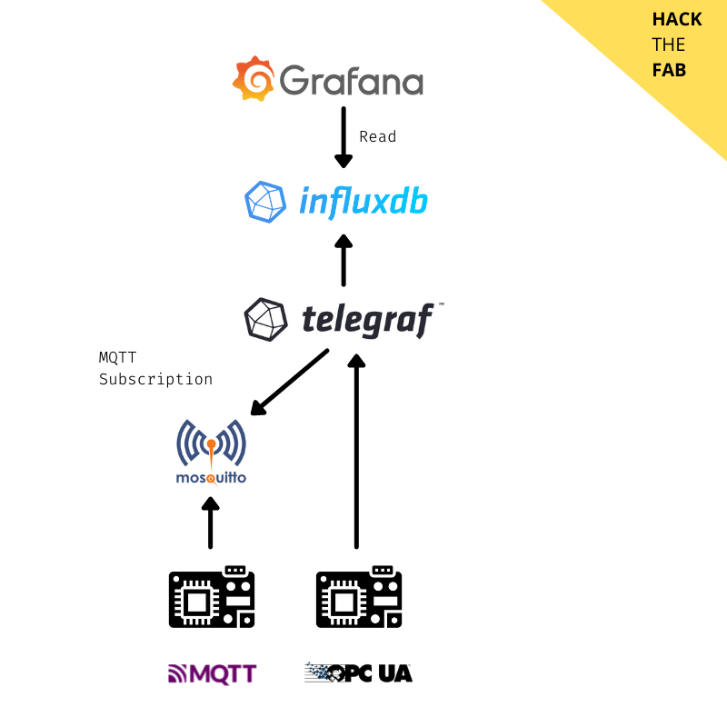

## Aufbau

Alle Kompenenten werden auf einer Holzplatte montiert.

## Datenstrom

## Kalkulation

Komponente              | Einzelpreis       | Gesamtpreis       | Quelle
------------------------|-------------------|-------------------|--------
Espressif ESP32:        | 9 €/Stk           | 18 €              |
Raspberry Pi 4B         | 45 €/Stk          | 45 €              | [reichelt](https://www.reichelt.de/raspberry-pi-4-b-4x-1-5-ghz-1-gb-ram-wlan-bt-rasp-pi-4-b-1gb-p259874.html?&trstct=pos_2&nbc=1)
5" LCD Display          | 44 €/Stk          | 44 €              | [reichelt](https://www.reichelt.de/raspberry-pi-shield-display-lcd-touch-5-800x480-pixel-rasp-pi-5td-wav-p227755.html?&trstct=pol_2&nbc=1)
Mikrotik hAP lite       | 25 €/Stk          | 25 €              | [reichelt](https://www.reichelt.de/de/de/hap-lite-mit-650mhz-cpu-32mb-ram-4xlan-mtk-hap-lite-p243883.html?PROVID=2788&gclid=Cj0KCQiA09eQBhCxARIsAAYRiyk2PP0oPYK61jo74_vPLcTcCsD46Yaj7i8-haKWOJvjBwyxyt5il5oaAoV0EALw_wcB&&r=1)
Holzplatte 400x400x19   | 10 €/Stk          | 10 €              |
**Gesamtkosten**        |                   | **142 €**         |

## OPC UA Implementierung

Quellen:
+ [influxdata](https://www.influxdata.com/integration/opcua/)

## MQTT Implementierung

Quellen:
+ [dzone](https://dzone.com/articles/raspberry-pi-iot-sensors-influxdb-mqtt-and-grafana)